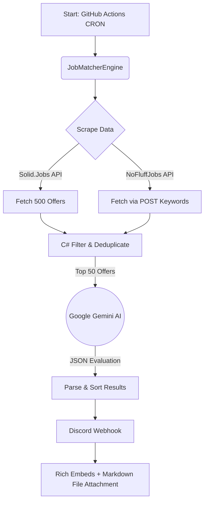
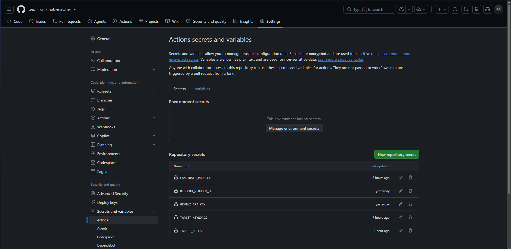

# 🤖 Job Matcher AI Agent


A Cloud-Native, automated AI recruitment agent that scrapes job boards, evaluates them against a personal profile using Google Gemini, and dispatches segmented Markdown reports to Discord.

---


---

### 📖 Table of Contents
- [About the Project](#-about-the-project)
- [Algorithm and Data Flow](#-algorithm-and-data-flow)
- [Tech Stack](#-tech-stack)
- [Getting Started](#-getting-started)
- [Configuration and Personalization](#-configuration-and-personalization)
- [Advanced AI Tuning](#-advanced-ai-tuning-prompt-engineering)
- [Project Structure](#-project-structure)

---

## 📝 About the Project

**Job Matcher Agent** is a custom tool that automates the job search process. Instead of browsing hundreds of ads every day, the agent performs this task autonomously. It fetches the latest offers, pre-filters them, and then passes them to the **Google Gemini** language model, which takes on the role of a rigorous IT recruiter.

The program's output is a clear report on a Discord channel, where the AI justifies its decision and points out any technological gaps the candidate may have relative to the job posting.

> **Versatility:** Although the current configuration is optimized by default for the IT industry, the application engine is completely generic. By editing the `appsettings.json` file, you can adjust the agent in seconds to search for offers in marketing, finance, or management!

---

## 🔄 Algorithm and Data Flow

The application uses the **Batch Processing** pattern to prevent API limit exhaustion and ensure an optimal context window for the LLM model. It also uses interfaces (`IJobScraper`) maintaining compliance with the SOLID Open/Closed principle.



### Main stages:
1. **Pipeline Trigger:** Initiated automatically via GitHub Actions (CRON schedule) or manually on-demand (`workflow_dispatch`).
2. **Smart Ingestion:** Asynchronous data fetching. In the case of NoFluffJobs, queries are targeted dynamically by keywords via POST payloads.
3. **C# Pre-filtering & Deduplication:** Rejecting spam and duplicates. The *Smart Ordering* option pushes target roles (e.g., Junior, Intern) to the top of the queue.
4. **AI Evaluation:** Deep analysis of the top 50 offers against the injected `profile.json` requirements and restrictive "Dealbreakers".
5. **Multipart Dispatch:** Assembling results into a *Rich Embeds* package and generating a native Markdown file sent directly to your Discord server.

---

## 💻 Tech Stack

| Technology / Tool | Application in the project |
| :--- | :--- |
| **.NET 9 / C#** | Main programming language and runtime environment (Worker Service). |
| **Google Gemini API** | LLM model performing the final candidacy evaluation (Prompts / JSON Schema). |
| **GitHub Actions** | CI/CD platform performing automated daily runs (CRON). |
| **Discord Webhooks** | Presentation layer and notification system (Embeds, .md files). |
| **REST APIs / HttpClient** | Asynchronous communication with external job aggregators. |

---

## 🚀 Getting Started

The tool is ready to be launched both on a local workstation and in the cloud (GitHub Actions).

### 1. Local Execution (Testing)
1. Clone the repository: `git clone https://github.com/your-profile/job-matcher.git`
2. Navigate to the root directory: `cd job-matcher/src/JobMatcher`
3. Create the `appsettings.Development.json` file based on the `appsettings.Example.json` template.
4. Copy `profile.template.json` to `profile.json` and fill in your details.
   *(Note: Ensure your `.csproj` file has `<CopyToOutputDirectory>PreserveNewest</CopyToOutputDirectory>` set for `profile.json` so the app can read it).*
5. Run the application:
```bash
dotnet build
dotnet run --environment Development
```

### 2. Cloud Execution (GitHub Actions)
The application automatically performs a full cycle once a day *(7:00 AM UTC)*. For the workflow to function, you must go to your repository settings on GitHub (**Settings -> Secrets and variables -> Actions**) and add the following secrets:
- `CANDIDATE_PROFILE` - The raw JSON content of your profile (like `profile.json`)
- `GEMINI_API_KEY` - Google API key.
- `DISCORD_WEBHOOK_URL` - Webhook URL generated on your Discord server.
- `TARGET_KEYWORDS` - String, e.g., `.NET, C#, React, Azure`
- `TARGET_ROLES` - String specifying the level, e.g., `Junior, Intern`



---

## ⚙️ Configuration and Personalization

All key system filters have been extracted into configuration templates, keeping the C# code "clean".

### A. Environment Configuration (`appsettings.Development.json`)
Create this file and place your keywords in it. They determine which data cluster the AI will use.

```json
{
  "TargetKeywords": ".NET, C#, React, Fullstack, Azure, Cloud, DevOps",
  "TargetRoles": "Junior, Intern",
  "AI": {
    "ApiKey": "YOUR_GEMINI_KEY"
  },
  "Notifications": {
    "DiscordWebhookUrl": "YOUR_DISCORD_WEBHOOK"
  }
}
```

### B. Your Profile (`profile.json`)
The engine makes decisions by analyzing your actual CV and projects. Fill out this file according to your current knowledge (you don't have to stick strictly to IT). Example for a Fullstack position:

```json
{
  "CandidateInfo": {
    "Name": "Kacper",
    "Availability": {
      "Location": "Kraków, Poland",
      "WorkModes": ["Remote", "Hybrid"]
    }
  },
  "Experience": [
    { "Role": "Web Developer Intern", "Duration": "3 months" }
  ],
  "CoreTechnologies": {
    "Backend": ["C#", ".NET 9", "EF Core"],
    "Frontend": ["React 18", "TypeScript", "Tailwind CSS"],
    "CloudAndDevOps": ["Microsoft Azure", "Terraform", "Docker"]
  }
}
```

---

## 🧠 Advanced AI Tuning (Prompt Engineering)

Your `profile.json` tells the system who you are, but the **System Prompt** decides how the AI should evaluate the listings.

To fully personalize the algorithm (e.g., change acceptable salary ranges, block specific cities, or change restrictions for Mid/Senior roles), go to the `src/JobMatcher/Clients/GeminiAiEvaluator.cs` file and edit the **CRITICAL RULES (DEALBREAKERS)** section in the Prompt query:

```csharp
CRITICAL RULES (DEALBREAKERS):
SENIORITY & EXPERIENCE: The candidate is targeting Junior/Entry-level roles...
LOCATION: The candidate is based in Kraków, Poland...
SALARY HEURISTIC: In Poland, salaries above 12,000 PLN generally indicate Mid/Senior expectations...
```

Strictly defining the above rules prevents LLM model hallucinations and drastically improves the effectiveness of notifications.

---

## 📂 Project Structure

The application has been designed in a modular way, making it easy to add new scrapers or notification platforms.

```text
📁 Main Structure (Root)
├── 📂 .github/workflows/
│   └── 📄 daily-run.yml            # Script automating execution via CI/CD
├── 📄 JobMatcher.sln               # Main solution file grouping projects
└── 📂 src/JobMatcher/              # Heart of the application
    ├── 📂 Clients/                 # External services (Scrapers, API)
    │   ├── 📄 NoFluffJobsScraper.cs
    │   ├── 📄 SolidJobsScraper.cs
    │   ├── 📄 GeminiAiEvaluator.cs
    │   └── 📄 DiscordNotifier.cs
    ├── 📂 Interfaces/              # Contracts and abstraction
    │   ├── 📄 IJobScraper.cs
    │   ├── 📄 IAiEvaluator.cs
    │   └── 📄 INotifier.cs
    ├── 📂 Models/                  # DTO structures and domain logic
    │   ├── 📄 JobOffer.cs
    │   └── 📄 JobEvaluationResult.cs
    ├── 📂 Services/                # Business logic
    │   └── 📄 JobMatcherEngine.cs  # Main Application Orchestrator
    ├── 📄 Program.cs               # Dependency Injection configuration and startup
    ├── 📄 appsettings.json         # URL and environment configuration
    └── 📄 profile.json             # Candidate Profile
```
