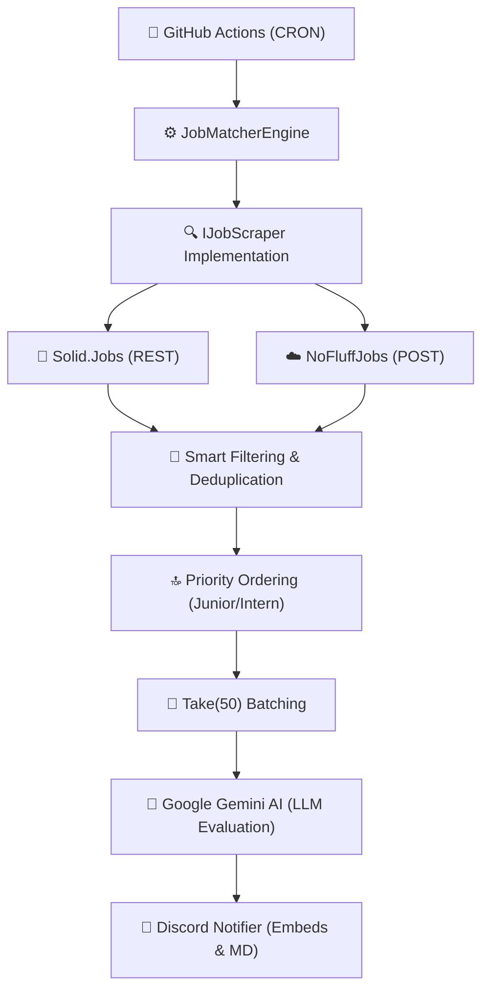
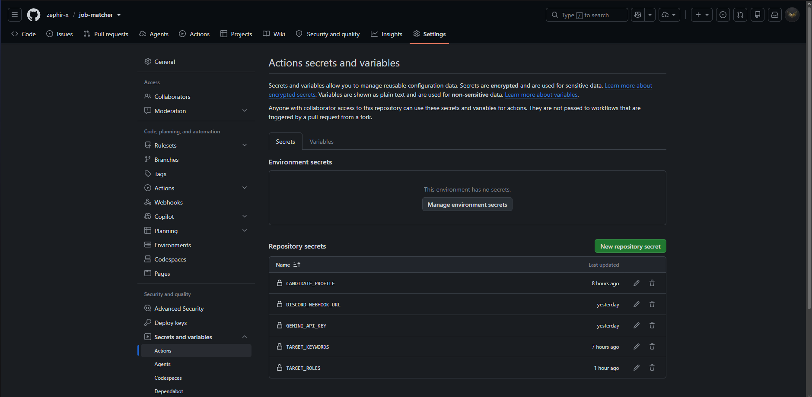
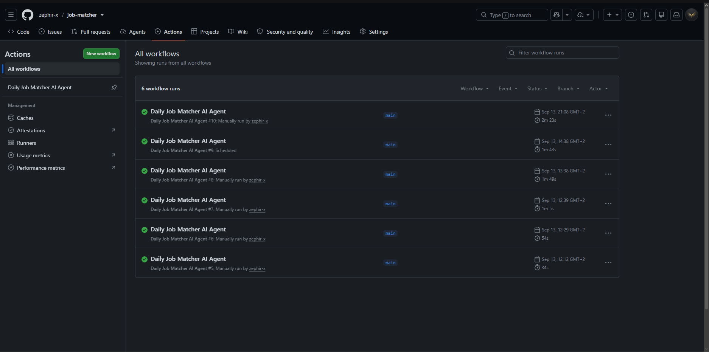
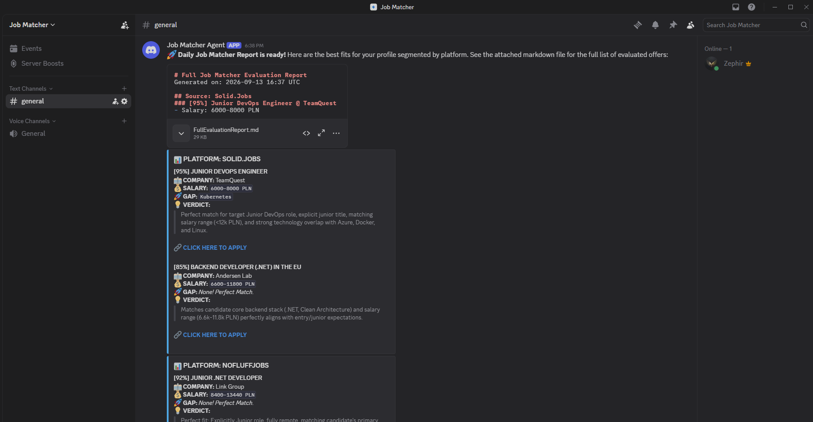

<div>

# 🤖 Job Matcher AI Agent

[](https://dotnet.microsoft.com/)
[](https://docs.microsoft.com/en-us/dotnet/csharp/)
[](https://github.com/features/actions)
[](https://ai.google.dev/)
[](https://discord.com/)

*An autonomous, cloud-native recruitment agent that leverages Generative AI to match you with your dream job.*

</div>

---

<details>
<summary>Table of Contents</summary>

- [About the Project](#-about-the-project)
- [Key Features & Architectural Marvels](#-key-features--architectural-marvels)
- [Algorithm Data Flow](#-algorithm-data-flow)
- [Tech Stack](#-tech-stack)
- [Getting Started](#-getting-started)
  - [Local Development](#1-local-development)
  - [Cloud Deployment (GitHub Actions)](#2-cloud-deployment-github-actions)
- [Configuration & Prompt Tuning](#-configuration--prompt-tuning)
- [Author / Contact](#-author--contact)

</details>

---

## 📝 About the Project

**Job Matcher AI Agent** is a sophisticated C# worker service designed to automate the tedious process of job hunting. By combining traditional web scraping with the semantic power of **Google Gemini LLM**, it acts as your personal technical recruiter. 

The agent scans multiple job boards, evaluates every offer against your unique professional profile, and delivers a curated, prioritized report directly to your Discord. No more browsing hundreds of irrelevant ads - get only the matches that truly matter.

> **💡 Versatility:** Although optimized for the IT sector by default, the underlying engine is completely industry-agnostic. By modifying the [`appsettings.json`](src/JobMatcher/appsettings.json) file, you can reconfigure the agent for marketing, finance, or management roles in seconds.

---

## 🏗️ Key Features & Architectural Marvels

This project isn't just a simple script; it's engineered with scalability, resilience, and cost-efficiency in mind:

*   **🧠 Smart Batching & Rate Limiting:** To prevent Gemini API exhaustion and optimize token usage, the agent processes offers in batches. It implements strategic `Task.Delay` intervals between scraper modules, ensuring compliance with external API rate limits while maintaining high throughput.
*   **🛡️ Graceful Degradation:** The architecture is built around the `IJobScraper` interface. This loose coupling ensures that even if one job portal (e.g., Solid.Jobs) is down or protected by a WAF (returning 503s), the rest of the pipeline continues to function unimpeded.
*   **⚡ Smart Ordering & Deduplication:** Before reaching the AI, data undergoes a rigorous C# optimization pipeline. We use `DistinctBy` to eliminate cross-platform duplicates and a custom `OrderByDescending` heuristic that pushes "Junior" and "Intern" roles to the top. This ensures that the `.Take(50)` limit captures the most relevant opportunities, saving precious LLM tokens.
*   **⏱️ Bypassing GitHub Actions Throttling:** The workflow CRON schedule is intentionally set to non-round minutes (e.g., `37 4 * * *`). This "Jitter" strategy avoids the heavy queuing and throttling that occurs when thousands of workflows trigger at the start of the hour on shared GitHub runners.
*   **🔐 Runtime Secret Injection:** Security is paramount. Sensitive candidate data isn't stored in the repository. Instead, the `profile.json` file is dynamically generated in-flight during the CI/CD pipeline execution using GitHub Secrets, ensuring your private CV details never leave the secure environment.

---

## 🔄 Algorithm Data Flow

The following diagram illustrates the high-level processing pipeline from trigger to notification:



---

## 💻 Tech Stack

| Technology | Application |
| :--- | :--- |
| 🚀 **.NET 9** | High-performance runtime for the core agent logic. |
| 🛡️ **C# 13** | Modern features like primary constructors and collection expressions. |
| 🧠 **Google Gemini** | Advanced LLM for semantic job-to-candidate matching. |
| 🎬 **GitHub Actions** | Automated orchestration, scheduling, and secret management. |
| 💬 **Discord Webhooks** | Real-time delivery of rich recruitment reports. |
| 📡 **REST APIs** | Asynchronous communication with external job aggregators. |

---

## 🚀 Getting Started

### 1. Local Development

To run the agent on your machine for testing:

1.  **Clone the Repo:** `git clone https://github.com/your-profile/job-matcher.git`
2.  **Configuration:** Create `src/JobMatcher/appsettings.Development.json` based on the [`appsettings.Example.json`](src/JobMatcher/appsettings.Example.json).
3.  **Profile Setup:** Copy [`profile.template.json`](src/JobMatcher/profile.template.json) to `profile.json` and fill in your technical details.
4.  **Important Note:** Ensure that `profile.json` and config files have the following property in your `.csproj` to be correctly picked up by the runtime:
    ```xml
    <CopyToOutputDirectory>PreserveNewest</CopyToOutputDirectory>
    ```
5.  **Execution:**
    ```bash
    dotnet build
    dotnet run --environment Development
    ```

### 2. Cloud Deployment (GitHub Actions)

The agent is designed to be "Zero-Infrastructure". Just fork and configure:

1.  **Secrets Configuration:** Navigate to `Settings -> Secrets and variables -> Actions` and add the following secrets:
    *   `CANDIDATE_PROFILE`: Raw JSON content of your `profile.json`.
    *   `GEMINI_API_KEY`: Your API key from Google AI Studio.
    *   `DISCORD_WEBHOOK_URL`: The URL for your Discord channel.
    *   `TARGET_KEYWORDS`: e.g., `.NET, C#, Azure`.
    *   `TARGET_ROLES`: e.g., `Junior, Intern`.

    <div>
    
    </div>

2.  **Manual Execution & Monitoring:** To trigger the agent manually or view execution history:
    *   Go to the **Actions** tab at the top of your repository.
    *   Select **Daily Job Matcher AI Agent** from the left sidebar.
    *   Click the **Run workflow** dropdown and confirm by clicking the button.
    *   You can click on any workflow run to see real-time logs and process details.

    <div>
    
    </div>

---

## ⚙️ Configuration & Prompt Tuning

### Personal Profile (`profile.json`)
The AI uses this JSON to understand your background. It's the "source of truth" for the matching process:

```json
{
  "CandidateInfo": {
    "Name": "Kacper",
    "Availability": {
      "Location": "Kraków, Poland",
      "WorkModes": ["Remote", "Hybrid"]
    }
  },
  "CoreTechnologies": {
    "Backend": ["C#", ".NET 9", "EF Core"],
    "Cloud": ["Azure", "Terraform", "Docker"]
  }
}
```

### AI Dealbreakers (Prompt Engineering)
The engine's precision comes from strict **Dealbreakers** defined in [`GeminiAiEvaluator.cs`](src/JobMatcher/Clients/GeminiAiEvaluator.cs). This prevents LLM hallucinations and ensures high-quality matches:

```csharp
CRITICAL RULES (DEALBREAKERS):
1. SENIORITY (STRICT): If title contains 'Senior', 'Lead', 'Architect', 
   MatchScorePercentage MUST be penalized (max 20%).
2. LOCATION: Candidate is based in Kraków. If strictly Office in other city, 
   score MUST be below 20%.
3. SALARY HEURISTIC: Salaries > 10,000 PLN in Poland often indicate Mid/Senior 
   expectations - downgrade unless explicitly 'Junior'.
```

### Output
The results are delivered as elegant Discord embeds:

<div>

</div>

---

## 👨‍💻 Author / Contact

Developed with ❤️ by **Kacper**.

[](https://www.linkedin.com/in/kacper-gumulak-dev)

---
<div>
🚀 <i>Happy Job Hunting!</i>
</div>
